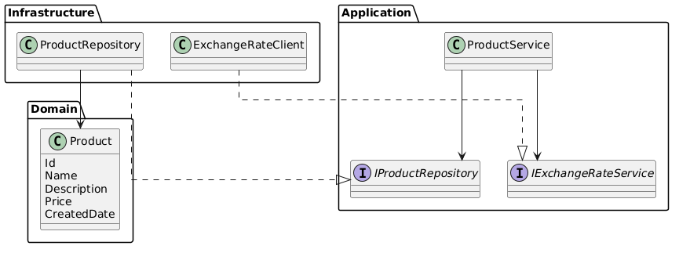
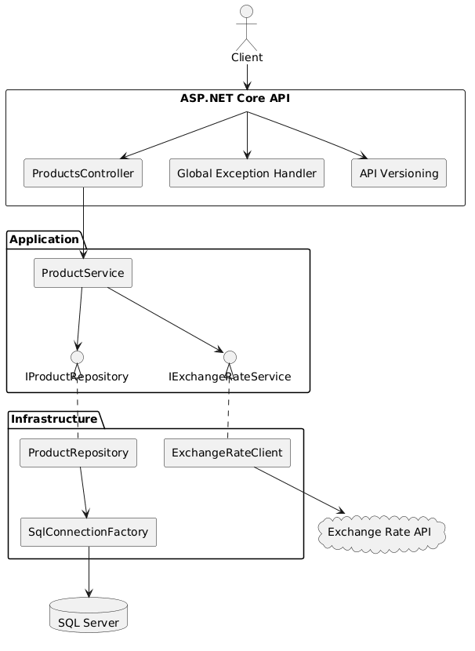

# .NET Developer Test

ASP.NET Core Web API for product management using SQL Server, Dapper and Stored Procedures.

## Technologies

- .NET 8
- ASP.NET Core Web API
- SQL Server
- Dapper
- FluentValidation
- API Versioning
- Swagger
- xUnit / Moq
- Docker

## Architecture

The solution follows a lightweight DDD-inspired architecture.





## Requirements

- Docker
- Docker Compose

## Run the Application

Clone the repository:

```bash
git clone https://github.com/coscristian/ProductAPI.git
cd SeniorDeveloperTest
```

Create the environment file:

```bash
cp .env.example .env
```

Start the application:

```bash
docker compose up --build
```

Execute the database script:

```text
database/SeniorDeveloperTest.sql
```

The script creates the database, table, indexes and Stored Procedures.

Open Swagger:

```text
http://localhost:8080/swagger
```

## Database

All Product CRUD operations use SQL Server Stored Procedures.

```text
sp_Product_Create
sp_Product_GetById
sp_Product_GetPaged
sp_Product_Update
sp_Product_Delete
```

Database script:

```text
database/SeniorDeveloperTest.sql
```

## Testing

Run the tests with:

```bash
dotnet test
```

Tests use xUnit and Moq.

## Stop

```bash
docker compose down
```

To reset the database:

```bash
docker compose down -v
docker compose up --build
```